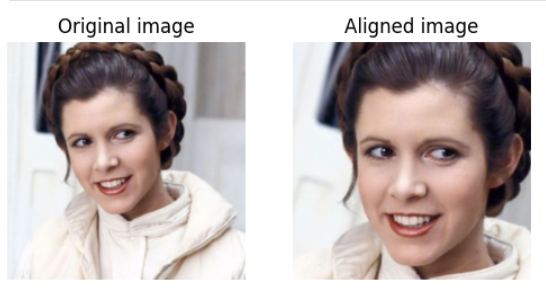
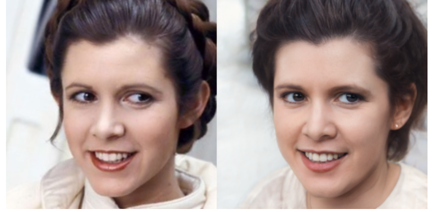
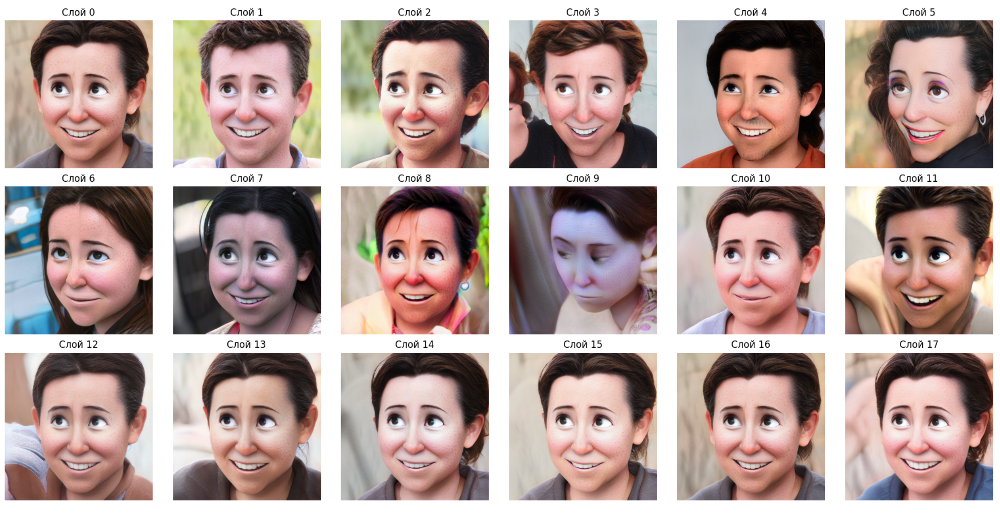

# Disney Style Transfer with StyleGAN-NADA

A Computer Vision project that transforms real human portraits into the **Disney animation style** using **StyleGAN-NADA** and **encoder4editing (e4e)**.

The pipeline performs image inversion into the latent space, applies style-guided latent manipulation, and generates stylized portraits while preserving facial identity.

## Results

### Disney Style Transfer

  

### Alignment

  

### Inversion

  

### Result

  

## Pipeline

  

The workflow consists of three main stages:

1. **Image Inversion** – project a real face into the StyleGAN latent space using **encoder4editing (e4e)**.
2. **Style Transfer** – apply **StyleGAN-NADA** guided by **CLIP** to shift the latent representation toward the Disney domain.
3. **Image Generation** – synthesize a stylized portrait while preserving the person's identity.

## Technologies

* Python
* PyTorch
* StyleGAN2
* StyleGAN-NADA
* encoder4editing (e4e)
* CLIP

## Acknowledgements

This project builds upon the following open-source research:

* StyleGAN-NADA
* encoder4editing (e4e)
* CLIP
